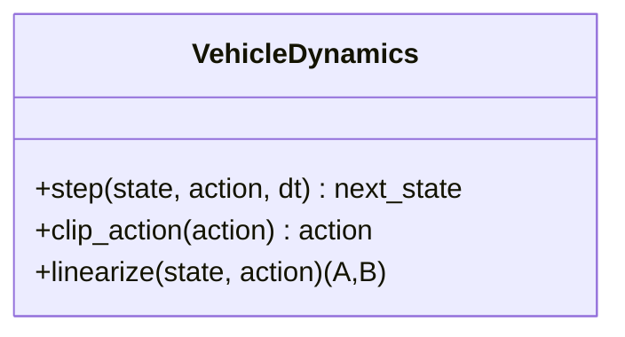
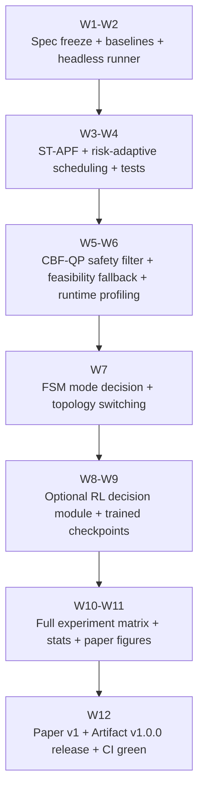

你现在面临的不是“再想一个新点子”，而是把两份已有方案合并成一个理论—算法—工程—实验—论文完全闭环、 可在 IEEE 级别（Transactions / 顶会）过审、并能开源复现的最终方案。 本终稿把你提供的两份输入（A：我先前给你的 APF-LF + 工程路线方案；B：Gemini 的高学术框架方案）进行“强 约束融合”，得到一个统一的研究主线： 总体目标（统一叙事）：在动态交通/动态障碍场景下实现多车协同编队（formation/platoon）运动规划与 控制，解决 APF 类方法的局部极小与缺少形式化安全保证的问题，在不走端到端黑盒的前提下，实现“可解 释的模型驱动控制 + 形式化安全层 + 高层决策模块”。 方法总结构（统一架构）：

1) 风险自适应时空势场（Risk-Adaptive Spatio-Temporal APF）：扩展 APF，使势场参数随风险指标

（如 TTC/最小间距）自适应；并将“脱困策略”从经验触发升级为可分析的机制。

2) 最小干预安全滤波（CBF-QP Safety Filter）：以控制屏障函数（CBF）建立安全集合的前向不变性，通

过二次规划（QP）在必要时对名义控制（来自 APF-LF）做最小修正，实现“Safe-by-Construction”的安全保 证。

3) 层级模式决策模块（Hierarchical Mode Decision）：上层做离散决策（拓扑变换/车道策略/参数档

位），下层仍由 APF-LF+CBF 连续控制执行；该层可以用轻量 RL（仅决策层，不端到端）或博弈启发式实 现，与多主体交互建模趋势对齐。

4) 开源工程闭环（Reproducible Simulation + Analyzer）：以可复现实验为第一目标（seed、配置、

CI），将“理论组件”逐一落到独立代码模块与单元测试上，形成顶级论文级 artifact。 这套方案在学术上明确对标以下五篇基准工作并“吸收其长处，避免重复其短处”： - 通过后向可达集（BRA/BRT） 在 MPC 中实现双层安全机制（风险评估 + 近不安全时才激活的最小干预约束），你的方案将其思想迁移到 APF-LF：风险自适应（attentive layer）+ CBF-QP（reactive constraint）。 - 分布式 APF 超车论文引入速度差/加速度差势场，并讨论稳定性与动态目标；你的“时空势场 + 自适应 + 安全滤波 + 高层决策”必须明确超越“仅加几个势场项”的增量贡献。 - 风险势场嵌入一致性与有限状态机的编队控制（有轨迹规划 + MPC 双层结构、Webots 验证）；你的模式决策层 与拓扑切换叙事需对齐该范式，但要强调你额外引入了形式化安全滤波与风险自适应机制。 - 非合作微分博弈编队/车队：强调交互具有策略性；你不必求解完整博弈，但可用其作为“为什么需要上层决策/交 互建模”的理论动机。 - 分层协作强化学习碰撞避免：证明“决策层学习 + 可扩展”的价值；你只在上层学习离散模式，避免黑盒端到端。 Gemini 文档本身提出的“Safe-by-Construction、博弈/串稳分析、RL 参数调度、工程模块化与设计模式”将被完整 吸收进这份终稿框架。

---

<!-- Page 2 -->

## 最终研究贡献陈述

下面给出可直接写进论文 Introduction 的正式贡献（建议写成 4 条；你可以按审稿意见删减为 3 条）：

### 贡献一：风险自适应时空势场的 APF-LF 名义控制器

提出一种风险驱动的势场参数自适应机制，将距离、相对速度/加速度等时空信息编码进势场，并通过风险指标（例 如 TTC、最小间距、风险势能）在线调度势场权重与作用半径，使系统在低风险时保持效率、高风险时增强规避能 力，从而在动态交通中提升成功率与鲁棒性。该贡献必须明确区别于仅引入速度差/加速度差势场的 APF 扩展。

### 贡献二：基于 CBF-QP 的最小干预安全滤波层，实现 Safe-by-Construction

在 APF-LF 名义控制输出之上构造 CBF 约束并求解 QP，使安全集合在可行条件下前向不变；当名义控制已满足安全 约束时，QP 解自动退化为名义控制，从而实现“只在接近不安全时才介入”的最小干预安全增强，与近年 reachability-based 最小干预思想一致。

### 贡献三：层级模式决策（拓扑/行为/参数档位）与编队稳定性分析框架

构建上层离散模式决策模块（可为有限状态机、启发式博弈评分或轻量 RL），用于在拥堵、窄通道、交互强的场景 中选择编队拓扑/让行-超车策略/参数档位；并给出编队误差收敛（或有界性）与串行稳定性（string stability）的 分析骨架，以桥接“离散决策 + 连续控制”的理论完整性。该方向与分布式风险势场编队与博弈车队文献方向一致。

### 贡献四：可复现的开源仿真-评测-对比平台（论文级 artifact）

实现一个高内聚低耦合的 Python 仿真平台：环境/动力学、控制器（含基线）、安全滤波、决策模块、指标计算与 导出完全解耦；提供可复现配置（configs + seeds）、批量实验 runner、统计检验脚本、CI 测试与一键复现实验 命令，满足顶级论文开源标准。

## 严格的问题表述与统一方法总览

### 系统建模：多车编队在道路约束与动态障碍下的运动规划与控制

设有 辆自主车辆组成编队（或车队/多车超车队形），车辆 的状态为 N i ⊤ x = i [p , p , ψ , v ] x,i y,i i i 控制输入为 ⊤ u = i [a , δ ] i i 其中 为纵向加速度、 为前轮转角。默认采用运动学自行车模型（kinematic bicycle）作为主体模型；若后续 ai δi 希望强化真实性，可在论文的“扩展讨论/未来工作”中加入包含轮胎侧偏（如 Magic Formula）的动力学模型。该做 法符合 Gemini 的模型假设要求。 道路边界（含车道线）定义一个可行区域，障碍物（静态/动态）集合为。目标是使编队在满足边界与 Xroad O(t) G G = comm (V, E) L 10 安全约束的条件下到达目标区域，同时保持编队几何形态（Formation Deformation Error 等指标最小）。分布 式/通信拓扑用图 表示，对应 Laplacian 可用于一致性/编队误差分析。

---

<!-- Page 3 -->

### 统一算法结构：名义控制 + 安全滤波 + 决策层

你的最终方法必须写成一个清晰的“层级控制栈”，便于审稿人对照理解： 1) 名义控制器（Nominal Controller）：Risk-Adaptive ST-APF + LF/Consensus 融合 - 以人工势场为基础（经典 APF 思路源于 Khatib 的实时避障概念）。

- 引入动态交通要素：速度差/加速度差势场思想与分布式超车 APF 论文一致，可作为你时空势场的“基础对照”。

- 输出名义输入。 unom,i

2) 安全滤波（Safety Filter）：CBF-QP

∗ unom,i - 对每个车辆-障碍/车辆-车辆对构造安全集合，通过 QP 求 使系统满足 CBF 约束并尽量接近。 C ui

- 这是你从“经验避障”跃迁到“形式化安全”的关键。
3) 决策层（Mode Decision）：FSM / RL / 博弈启发式

- 输出离散模式，例如：编队拓扑（列队/楔形/菱形）、让行/超车开关、参数档位（risk-gain m ∈ t M schedule）等。

- RL 仅用于模式决策与参数调度，避免黑盒端到端；该思想与协作 RL 碰撞避免框架的“分层训练/策略分发”家族一

致。 - 博弈动机：在多主体交通中，对手行为不可控且可能“非合作”，因此仅靠局部势场反应不够，需要上层策略选择； 该论证可引用非合作微分博弈车队工作。

## 理论分析草图：你必须证明或至少严谨论证什么

你不需要写成一本控制理论教材，但必须给出可检查的命题（Lemma/Theorem）与清晰的假设。这部分是从“工程 demo”升级到“IEEE 论文”的分水岭。

### 核心定义

风险指标：由最小间距 、时间到碰撞 TTC、相对速度等构造，例如 • R (t) i dmin R (t) = i w ⋅ 1 ϕ(d ) + min w ⋅ 2 ϕ(TTC ) + min w ⋅ 3 ϕ(∥Δv∥) 其意义对应于 reachability 方法中的“持续风险评估（attentive layer）”，但你的实现更轻量、可用于在线 调参。 安全集合（Safe Set）：对每个约束对象 （障碍或其他车辆）定义 • C j 2 dsafe h (x) ≜ ij ∥p − i p ∥− j C = {x : h (x) ≥ ij 0, ∀j} + h˙ α(h) ≥0 α K 安全集合为。CBF 理论要求 （ 为 class- 函数）以保证前向 不变性。

---

<!-- Page 4 -->

### 建议写入论文的命题集合（最小充分集）

### Lemma A（自适应势场参数有界性）

在风险调度函数采用饱和/投影算子时，势场参数（如 、作用半径 ）全程有界： k (t) rep d (t) 0 k ≤ min k (t) ≤ rep k , d ≤ max min d (t) ≤ 0 dmax 并且是分段 Lipschitz，从而保证名义闭环控制的解存在唯一（常微分方程基本理论）。 代码对应：AdaptiveAPFController.update_params() 必须实现投影与饱和；单元测试检查参数无越界 （见后文测试映射）。

### Lemma B（最小干预性质 / 不激活时等价性）

unom,i u = i ∗ unom,i 若在某时刻名义控制 满足所有 CBF 约束，则 QP 的最优解满足。 这是“最小干预”的数学表达，与 BRA-MPC 文献提出的“只在近不安全时激活约束以保留灵活性”思想一致。

### Theorem C（安全集合前向不变性）

+ h˙ α(h) ≥0 C 在（i）动力学满足可控性与光滑性，（ii）QP 在每个时刻可行，（iii）CBF 约束采用 形式下，闭环 系统使 前向不变，即初始安全则全程安全。 引用依据：CBF 理论综述与应用框架。

### Proposition D（编队误差收敛/有界性：一致性 + 势场耦合）

当通信图连通且一致性项权重满足特定下界时，编队误差动力学可证明为渐近稳定或输入到状态稳定（ISS）；风险 势场项作为扰动进入，可给出上界。该论述应对标“分布式一致性嵌入风险势场”的编队控制框架。

### Proposition E（串行稳定性 skeleton：纵向 PF/TPF 线性化）

对纵向间距误差的线性化模型，给出 或 意义的串稳条件（误差沿车队放大不超过 1）。你可以把完整严格 L2 H∞ 证明作为附录草图，但正文必须说明假设与结论形式。该方向的动机可引用差分博弈车队与分布式超车稳定性陈 述。 你要明确：理论证明不是“越多越好”，而是“每一个命题都能落地到实现与实验验证”。否则就是自杀 式堆砌。

## 理论到代码的逐条映射：模块、类、接口、测试

下面给出一个强制执行的工程蓝图：每个理论对象必须有对应代码模块、可调用接口、以及最少 1 个测试用例证明 实现符合理论假设。

### 包结构建议（src layout + 可复现实验优先）

```text
src/
apflf/
env/
dynamics.py # VehicleDynamics: kinematic bicycle (default)
road.py # lane/boundary model, Frenet transforms
obstacles.py # static/dynamic obstacle models
```

---

<!-- Page 5 -->

geometry.py # distance/clearance/collision primitives scenarios.py # ScenarioFactory, seeded generation controllers/ base.py # Controller interface (Strategy) apf.py # (baseline) classical APF (Khatib-style) apf_st.py # spatio-temporal APF components (Δv/Δa) lf.py # leader-follower / consensus terms apf_lf.py # fused nominal controller adaptive_apf.py # AdaptiveAPFController (risk scheduling) safety/ cbf.py # CBF definitions h(x), Lie derivatives qp_solver.py # OSQP/CVXOPT backend adapters safety_filter.py # CBFSafetyFilter wrapper decision/ mode_base.py # ModeDecisionModule interface fsm_mode.py # finite-state machine (baseline) rl_mode.py # optional: RL discrete policy (SB3) game_heuristic.py # optional: game-inspired scoring analysis/ metrics.py # FDE, PSI + extended metrics stats.py # CI, tests, effect sizes export.py # tables/figures for paper sim/ world.py # step loop, seed control, logging hooks runner.py # batch experiments (headless) replay.py # deterministic replay from logs ui/ app.py # PySide6 GUI (optional consumer) widgets.py tests/ configs/ scripts/

### 关键类设计：属性、方法、接口契约

你必须按“接口契约”写 docstring 与类型标注；否则所有后续实验都会失控。

### VehicleDynamics

理论对应：系统状态转移 （默认运动学自行车）。 • x = t+1 f(x , u ) t t • 核心属性：wheelbase , dt , a_min/a_max , delta_min/delta_max , v_min/v_max 核心方法： step(state, action, dt) -> next_state clip_action(action) -> action （理论假设：输入有界） linearize(state, action) （可选；用于串稳/局部分析或 QP Jacobian 校验）

---

<!-- Page 6 -->

测试要求：

- test_action_clipping_bounds() ：任何输入都被裁剪到约束内（对应 Lemma A 的“有界输入”假设）。
- test_forward_integrator_determinism_seed() ：同 seed 同初值同控制序列必须逐步一致（复现性前

提）。

### AdaptiveAPFController

理论对应：Risk-Adaptive ST-APF 名义控制。 • unom • 核心属性：k_att0 , k_rep0 , d0_0 , risk_thresholds , schedule_fn , escape_fn 核心方法： compute_nominal_action(obs) -> action update_params(risk) -> None （实现投影/饱和） compute_potential_terms(obs) -> dict （用于论文可视化：力分解） detect_stagnation(history) -> bool （局部极小/停滞检测） escape_control(obs) -> action_delta （脱困项：建议用切向/旋涡场而非任意虚拟点，论文更可 解释） 测试要求：

- test_param_projection() ：参数永不越界（Lemma A）。

- test_monotone_repulsion_vs_risk()：风险增大时 不减（对审稿人是“可信的自适应”）。 krep

- test_stagnation_detector_no_false_positive_simple() ：简单无障碍场景不应触发脱困。

理论依据与动机需要对标：分布式超车 APF 中的速度差/加速度差势场思想可作为 ST-APF 的基础组件引用。

### CBFSafetyFilter

理论对应：CBF 约束 + QP 求解，保证安全集合前向不变（Theorem C）。 核心属性：d_safe , alpha , kappa , active_risk_threshold , solver_backend 核心方法： is_active(risk) -> bool （对应“近不安全时才介入”的最小干预思想） build_constraints(obs) -> (P, q, A, l, u) （OSQP 风格） filter(u_nom, obs) -> u_safe feasibility_check(...) （必要时触发 fallback：紧急制动/停车/模式切换） 测试要求：

- test_minimal_intervention_identity_when_safe() ：当约束不紧时，输出应等于名义控制（Lemma

B）。 + h˙ α(h) ≥0 - test_cbf_violation_reduction()：刻意构造即将碰撞的两车状态，滤波后 数值成立。

- test_infeasible_case_fallback() ：无可行解时必须返回定义明确的安全降级策略（论文必须说明）。

### ModeDecisionModule

理论对应：离散模式 的选择：拓扑切换、策略切换、参数档位；支撑串稳/编队稳定性的结构化叙事。其 • mt 动机可引用“有限状态机编队过渡模型 + 双层控制”编队论文。 核心属性：mode_set , policy_type , fsm_graph , rl_policy(optional) , hysteresis 核心方法：

---

<!-- Page 7 -->

select_mode(obs) -> mode apply_mode(mode, controller, formation_graph) -> None （把 mode 映射到控制器参数/拓 扑） reset(seed) train(...) （仅 rl_mode 需要；训练完全不影响 headless runner 的可复现性） 测试要求：

- test_mode_determinism() ：同 seed 同输入序列输出模式一致。
- test_hysteresis_prevents_chattering() ：防止频繁切换（否则实验数据不可解释）。

RL 仅作为“模式决策/参数调度”的可选实现，其合理性可引用协作 RL 碰撞避免/分层训练类框架的核心观点（扩展 性、分布式策略）。

### AcademicAnalyzer

理论对应：指标定义与统计检验是论文可信度核心；必须实现“指标可重复计算 + 固定脚本导出表图”。 核心方法： record_step(snapshot) compute_metrics() -> dict compute_ci(method="bootstrap") export_tables(path) 、export_figures(path) （IEEE 风格：eps/pdf） 必须包含的指标扩展（除 FDE/PSI）：

- 安全：碰撞率、最小间距、最小 TTC、边界越界次数。
- 效率：到达率、到达时间、路径长度比。
- 舒适/可控：加速度/转角/jerk RMS，饱和率。
- 计算：每步 runtime、QP 求解时间分布。

这些指标对应自主驾驶/多智能体规划评测的基本共识，同时 DWA/ORCA 等基线也常以类似维度对比。

## 工程时间线：里程碑、验收标准、失败即返工

下面按 12 周给出一个对新手仍可执行、但足够严格的里程碑表（你可按学期调整到 16 周；结构不变）。 阶段 周期 里程碑产出 验收标准（Acceptance Criteria） 规格冻 headless runner + 场 runner.py 可在 CLI 下批量跑 30 seeds；输出 CSV；同 W1- W2 结与基 景生成 + 2 个基线 seed 结果 bitwise 一致（误差容忍需声明） 线跑通 （APF、APF-LF） 时空 通过 test_param_projection 、 APF 与 apf_st.py + W3- W4 test_monotone_repulsion_vs_risk；在动态交叉障 风险调 adaptive_apf.py 碍场景成功率显著高于固定参数（至少 +10%） 度

---

<!-- Page 8 -->

阶段 周期 里程碑产出 验收标准（Acceptance Criteria） CBF-QP 在所有测试场景碰撞率显著下降； cbf.py + 安全层 W5- W6 test_minimal_intervention_identity_when_safe safety_filter.py （核 通过；QP 平均求解时间 < 5ms（基准机上） + QP backend(OSQP) 心） 模式决 W7 fsm_mode.py + 拓 策 在窄通道场景能自动从楔形/菱形切换至列队并恢复；切换无 （FSM 扑切换逻辑 抖动（hysteresis 生效） 先行） 模式决 rl_mode.py + 训练 RL 仅输出离散模式；训练日志、模型 checkpoint、评测脚本 W8- W9 策（可 脚本 完整；若 RL 不稳定，必须保留 FSM 作为主版本 选 RL） 大规模 实验与 W10- W11 实验矩阵全跑完 + 统计 每项指标提供 mean±std、95% CI；至少 1 个显著性检验 统计检 脚本 （paired t 或 Wilcoxon）；生成论文表图 验 仓库含 LICENSE 、README 、CITATION.cff 、 论文写 W12 论文初稿 v1 + artifact v1 作与开 configs/ 、scripts/reproduce.sh 、CI 绿灯；论文 源打包 Methods/Experiments 完整对齐代码 你要记住：没通过验收标准的代码一律视为未完成，不要急着写论文。

## 实验矩阵：场景、基线、消融、统计检验与预期图表

### 场景族（Scenarios）：必须覆盖“局部极小、动态交互、拓扑切换、安全边界”四类压力

场景族 ID 场景描述 关键参数扫描 主要考察点 S1 局部极小陷 U 型/对称障碍诱导 障碍间距、入口 脱困机制有效性（传统 APF 易陷局部极小是 阱 APF 停滞 宽度 经典问题） S2 动态交叉障 横穿/斜穿动态障碍， 障碍速度、密 度、噪声 风险调度与 ST-APF 的动态鲁棒性 碍 速度不确定 S3 窄通道 + 编 通道宽度不足以保持原 通道宽、队形尺 模式决策/拓扑切换有效性（对标 FSM 编队 队变形 队形 度 过渡思路） S4 双车道交互 前车 + 对向车 + 多主体 干扰 对向流速、gap 对标 reachability 超车与分布式 APF 超车叙 超车 事 S5 多智能体密 集避碰 多车随机初值互相避碰 车辆数 N、密度 与 ORCA/DWA 等基线对比、扩展性

---

<!-- Page 9 -->

### 必选基线（Baselines）：否则审稿人会认为你在“软对比”

B1 经典 APF（Khatib-style）：用于证明局部极小问题确实存在。 B2 APF-LF（无自适应、无安全层、无决策层）：你的“最小可发表基线”。 B3 分布式超车 APF（Δv/Δa 势场）：用来反驳“你只是加了速度势场项”。 B4 风险势场 + 一致性/双层结构思想基线：对照编队控制文献的范式。 B5 DWA（Dynamic Window Approach）：经典反应式运动规划基线。 B6 ORCA（或其 Python 封装/复刻）：多主体碰撞避免强基线；可直接参考 RVO2/ORCA 文档与原论文。 注意：DWA/ORCA 与车辆动力学不完全一致，你必须在论文里声明“作为多智能体避碰参考基线”， 并用统一的输入约束把它们“适配到可比层面”，否则会被抓漏洞。

### 消融实验（Ablations）：每条贡献至少一个消融

消融 ID 移除组件 预期现象（你必须用数据证实） A1 无风险自适应（固定势场参数） 动态场景成功率下降、近碰风险升高 A2 无 CBF-QP 安全层 碰撞率/最小间距指标明显变差（关键证据） A3 无模式决策（固定拓扑） 窄通道场景失败率显著升高、拓扑抖动为 0 但通过率不足 A4 无脱困机制 S1 局部极小陷阱中停滞率显著上升 A5 无 Δv/Δa 时空项 S2/S4 中对动态交互反应迟缓、TTC 指标恶化

### Seeds、统计与图表（写进论文的“硬要求”）

每个场景族至少 30 seeds（避免偶然性）。 统计：mean±std + 95% CI（bootstrap）；方法对比用 paired t-test 或 Wilcoxon（按分布选择），并报告 效应量。 论文核心表图建议： Table：总体指标对比（安全/效率/舒适/计算） Figure：典型轨迹叠加（S1/S4）、风险随时间曲线、QP 修正量随时间曲线（证明最小干预）、拓扑切换时 间线、runtime 直方图。 reachability-based 超车论文强调“开启/关闭安全约束对碰撞后果的差异对比”，你的 A2 实验可以明确对齐 这种展示方式。

## IEEE 风格论文骨架：二级标题 + 每节必须包含的图/公式

你要求“到二级标题”。我按 Transactions 常见结构给出，但不在标题行写编号（编号由你在 LaTeX 模板中添加）。

### Introduction

必须包含：问题背景、APF-LF 的优势与缺陷（局部极小 + 缺少形式化安全）、你的三层架构动机、贡献列 表。

---

<!-- Page 10 -->

图：一个“动态交互 + 潜在碰撞”的动机示意图；一张方法总览框图。

### Related Work

子节要点： APF 与局部极小问题（引用 Khatib）。 分布式超车 APF（Δv/Δa、动态目标、稳定性）。 风险势场嵌入一致性/编队与 FSM 过渡模型。 形式化安全：reachability 最小干预思想 + CBF 理论。 多主体交互：非合作博弈与分层 RL。

### Problem Formulation

子节必须写清：车辆模型（自行车）、道路边界约束、安全集合、编队目标函数（FDE 等）、优化/控制目 标。 公式：动力学方程；安全集合；编队误差定义；风险指标定义。 • h(x)

### Methodology

子节建议： 名义控制：ST-APF + LF/Consensus 融合（给出势场项与融合律）。 风险自适应调度：参数更新律（含投影/饱和）+ 停滞检测与脱困。 CBF-QP 安全滤波：CBF 约束、QP 形式、最小干预性质阐述。 模式决策：FSM 规则表（主版本）+ RL 离散策略（可选附录），以及模式到拓扑/参数的映射。 图：3D/热力势场示意（至少一张），QP 修正示意（名义 vs 安全后轨迹）。

### Theoretical Analysis

子节最少包含： 参数有界性与名义闭环解存在性（Lemma A）。 最小干预等价性（Lemma B）。 安全集合前向不变性（Theorem C，引用 CBF 理论）。 编队误差收敛/有界性分析骨架（Proposition D，对齐一致性+风险势场架构）。 串稳分析 skeleton（Proposition E，可放附录）。

### Experiments

必须包含：场景生成器参数范围、seed、基线、消融、统计方法。 图表：实验矩阵表、总体对比表、消融柱状图、运行时间分布、失败案例分析。

### Conclusion

必须包含：贡献总结、限制（QP 可行性、模型误差等）、未来工作（更复杂动力学/真实交通交互）。

### Appendix / Artifact

必须包含：算法伪代码、关键超参表、复现命令、CI/环境说明。

---

<!-- Page 11 -->

## 可复现性清单与 artifact 发布计划

### 复现性清单（Reproducibility Checklist）

环境锁定：pyproject.toml / poetry.lock 或 uv.lock；明确 Python 版本。 配置即实验：所有实验通过 configs/*.yaml 描述；代码不接受“手动点 UI 改参数”作为实验来源。 种子制度：全链路 seed（numpy/random/torch）；日志记录 seed 与 git commit hash。 一键复现：scripts/reproduce_all.sh 生成论文主表与关键图。 指标一致性：同一轨迹的 metrics 重算必须一致（replay.py + AcademicAnalyzer ）。 CI 测试：至少包括单元测试、格式检查、最小实验 smoke test（跑 1 个场景 2 seeds）。 结果可追溯：每个实验产出包含：配置文件、summary.csv、raw trajectory、figures、stats report。

### artifact 发布计划

仓库根目录必须包含：README.md （快速开始 + 复现实验）、LICENSE （建议 Apache-2.0 或 MIT）、 CITATION.cff 、docs/ （方法说明与 API）、configs/ 、scripts/ 、tests/。 版本管理：v1.0.0 对应论文投稿版本；若论文接收后补发 v1.1.0 （修复/补充基线）。 建议将论文对应实验结果打包并上传到长期存档平台（如 Zenodo）生成 DOI（你需要在论文里引用）。

## Mermaid 结构图建议

下列 mermaid 代码你可以直接放到仓库文档（README 或 docs）里。

### 包/模块结构图

```mermaid
flowchart LR
subgraph ENV[apflf.env]
DYN[dynamics.py\nVehicleDynamics]
ROAD[road.py\nRoad & Frenet]
OBS[obstacles.py\nObstacles]
GEO[geometry.py\nCollision/Distance]
SCN[scenarios.py\nScenarioFactory]
end
subgraph CTRL[apflf.controllers]
APF[apf.py\nClassical APF]
ST[apf_st.py\nSpatio-temporal APF]
LF[lf.py\nLF/Consensus]
ADP[adaptive_apf.py\nRisk-adaptive APF]
FUS[apf_lf.py\nNominal Fusion]
end
subgraph SAFE[apflf.safety]
CBF[cbf.py\nCBF constraints]
QP[qp_solver.py\nOSQP/CVXOPT]
FIL[safety_filter.py\nCBF-QP Filter]
```

---

<!-- Page 12 -->

```mermaid
end
subgraph DEC[apflf.decision]
FSM[fsm_mode.py\nFSM policy]
RL[rl_mode.py\nOptional RL policy]
end
subgraph SIM[apflf.sim]
WORLD[world.py\nStep loop]
RUN[runner.py\nBatch experiments]
REP[replay.py\nDeterministic replay]
end
subgraph ANA[apflf.analysis]
MET[metrics.py\nMetrics]
STATS[stats.py\nCI & tests]
EXP[export.py\nTables/Figures]
end
```

RUN --> WORLD --> CTRL --> SAFE --> WORLD WORLD --> ANA DEC --> CTRL ENV --> WORLD

### 类关系图



class BaseController { <<interface>> +compute_nominal_action(obs) action } class AdaptiveAPFController { +update_params(risk) +compute_potential_terms(obs) dict +detect_stagnation(history) bool +escape_control(obs) action_delta } class CBFSafetyFilter {

---

<!-- Page 13 -->

+is_active(risk) bool +build_constraints(obs) QPForm +filter(u_nom, obs) u_safe } class ModeDecisionModule { <<interface>> +select_mode(obs) mode +apply_mode(mode, controller, graph) } class AcademicAnalyzer { +record_step(snapshot) +compute_metrics() dict +export_tables(path) +export_figures(path) } BaseController <|-- AdaptiveAPFController VehicleDynamics --> BaseController : provides model constraints CBFSafetyFilter --> BaseController : filters nominal action ModeDecisionModule --> AdaptiveAPFController : schedules params/topology AcademicAnalyzer --> VehicleDynamics : reads trajectories

### 时间线流程图



https://authors.library.caltech.edu/records/51yvp-rha55/latest https://authors.library.caltech.edu/records/51yvp-rha55/latest https://www.sciencedirect.com/science/article/pii/S0967066125004174 https://www.sciencedirect.com/science/article/pii/S0967066125004174 https://research.manchester.ac.uk/en/publications/distributed-motion-planning-for-safe-autonomous- vehicle-overtakin/ https://research.manchester.ac.uk/en/publications/distributed-motion-planning-for-safe-autonomous-vehicle-overtakin/

---

<!-- Page 14 -->

https://www.mendeley.com/catalogue/0ec9cb88-dd70-3e3b-918f-1b37b6a9272e/ https://www.mendeley.com/catalogue/0ec9cb88-dd70-3e3b-918f-1b37b6a9272e/ https://www.emergentmind.com/papers/2310.09279 https://www.emergentmind.com/papers/2310.09279 RACE: Reinforced Cooperative Autonomous Vehicle Collision Avoidance - TRID https://trid.trb.org/View/1745656?utm_source=chatgpt.com https://www.shibatadb.com/article/NfeviDtw https://www.shibatadb.com/article/NfeviDtw https://www.ri.cmu.edu/publications/the-dynamic-window-approach-to-collision-avoidance/ https://www.ri.cmu.edu/publications/the-dynamic-window-approach-to-collision-avoidance/ https://link.springer.com/chapter/10.1007/978-3-642-19457-3_1 https://link.springer.com/chapter/10.1007/978-3-642-19457-3_1 https://discovery.ucl.ac.uk/id/eprint/10151756/1/FINAL_VERSION.pdf https://discovery.ucl.ac.uk/id/eprint/10151756/1/FINAL_VERSION.pdf

---

## PDF 中的链接

- https://chatgpt.com/?utm_src=deep-research-pdf
- https://authors.library.caltech.edu/records/51yvp-rha55/latest
- https://www.sciencedirect.com/science/article/pii/S0967066125004174
- https://research.manchester.ac.uk/en/publications/distributed-motion-planning-for-safe-autonomous-vehicle-overtakin/
- https://www.mendeley.com/catalogue/0ec9cb88-dd70-3e3b-918f-1b37b6a9272e/
- https://www.emergentmind.com/papers/2310.09279
- https://trid.trb.org/View/1745656?utm_source=chatgpt.com
- https://www.shibatadb.com/article/NfeviDtw
- https://www.ri.cmu.edu/publications/the-dynamic-window-approach-to-collision-avoidance/
- https://link.springer.com/chapter/10.1007/978-3-642-19457-3_1
- https://discovery.ucl.ac.uk/id/eprint/10151756/1/FINAL_VERSION.pdf